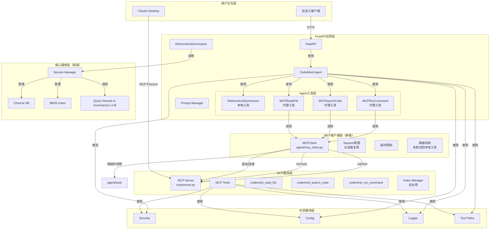
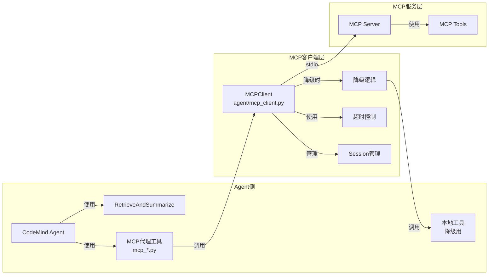

# 系统架构设计

## 整体架构图



## 调用链详解

### 新的完整调用链

```
用户请求
    ↓
FastAPI /chat 端点
    ↓
ServiceManager.get("agent")
    ↓
CodeMindAgent.aexecute(question, history)
    ↓
LangChain Agent 决策
    ├─→ 需要检索 → RetrieveAndSummarize（本地，直接调用 ServiceManager）
    ├─→ 需要读文件 → MCPReadFile（代理工具）→ MCPClient → MCP Server → codemind_read_file
    ├─→ 需要搜索 → MCPSearchCode（代理工具）→ MCPClient → MCP Server → codemind_search_code
    └─→ 需要执行命令 → MCPRunCommand（代理工具）→ MCPClient → MCP Server → codemind_run_command
    ↓
Agent 生成最终回答
    ↓
返回给用户
```

## 新目录结构

```
code-mind-agent/
├── app.py                          # 原FastAPI应用（保留）
├── agent/
│   ├── agent.py                    # Agent核心（更新：get_tools() 返回混合工具集）
│   ├── security.py                 # 安全模块（共享）
│   ├── tool_paths.py               # 路径工具（共享）
│   ├── mcp_client.py              # ⭐ 新增：MCP客户端
│   └── tools/
│       ├── __init__.py
│       ├── retrieve_and_summarize.py  # ⭐ 保留在原应用
│       ├── output_truncation.py
│       ├── read_file.py            # 保留副本作为降级
│       ├── search_code.py          # 保留副本作为降级
│       ├── run_command.py          # 保留副本作为降级
│       ├── mcp_read_file.py       # ⭐ 新增：MCP代理工具
│       ├── mcp_search_code.py     # ⭐ 新增：MCP代理工具
│       └── mcp_run_command.py     # ⭐ 新增：MCP代理工具
├── mcp/                            # MCP服务（已有）
│   ├── __init__.py
│   ├── server.py                   # MCP服务器入口
│   ├── sdk.py                      # SDK兼容层
│   ├── tools/
│   │   ├── __init__.py
│   │   ├── base.py                 # MCP工具基类
│   │   ├── read_file.py            # codemind_read_file
│   │   ├── search_code.py          # codemind_search_code
│   │   ├── run_command.py          # codemind_run_command
│   │   └── index_manager/          # 索引管理（后台用）
│   │       ├── __init__.py
│   │       ├── index_repo.py
│   │       ├── add_by_file_path.py
│   │       └── delete_by_file_path.py
│   ├── security.py -> ../agent/security.py
│   └── tool_paths.py -> ../agent/tool_paths.py
├── scripts/                        # 保留（可被MCP包装调用）
├── services/
│   └── service_manager.py          # ⭐ 更新：增加 MCP client 管理
├── utils/
│   ├── config.py                   # ⭐ 更新：增加 MCP 配置项
│   └── ...
├── tests/
│   └── test_mcp/
│       ├── test_server.py
│       ├── test_client.py         # ⭐ 新增：MCP客户端测试
│       └── tools/
├── config.yml                      # ⭐ 更新：增加 MCP 配置
├── requirements.txt                # 添加MCP依赖
└── mcp_client_config.json          # Claude Desktop 配置
```

## 依赖关系



## 共享模块方案

为了避免代码重复，采用以下共享策略：

1. **符号链接** - `mcp/security.py` -> `agent/security.py`，`mcp/tool_paths.py` -> `agent/tool_paths.py`
2. **直接复用** - `utils/config.py`、`utils/logger.py` 两个服务都通过相同路径导入
3. **复制副本** - 原应用的 `agent/tools/read_file.py`、`search_code.py`、`run_command.py` 保留作为降级路径

### 符号链接的注意事项

- Windows环境下创建符号链接需要管理员权限
- Git会保留符号链接信息，跨平台协作时需注意
- 提供复制脚本作为备选方案

## MCP 客户端设计要点

### 核心功能

1. **生命周期管理**
   - ServiceManager 初始化时启动 MCP server 子进程
   - ServiceManager 清理时关闭 MCP server
   - 支持健康检查和自动重启

2. **连接复用**
   - 建立长连接，避免每次 tool call 都重启进程
   - Session 管理，维护 stdio 管道

3. **工具调用**
   - `list_tools()` - 获取可用工具列表
   - `call_tool(name, arguments)` - 调用指定工具

4. **超时控制**
   - MCP client 有独立的超时配置
   - 超时后自动取消请求

5. **降级机制**
   - MCP 调用失败时，可配置是否降级到本地工具
   - 降级对 Agent 透明

### 关键配置项

```yaml
mcp:
  enabled: true              # 是否启用 MCP
  transport: "stdio"         # 传输方式（目前仅 stdio）
  server_command: "python mcp/server.py"  # 启动命令
  call_timeout: 30           # 调用超时（秒）
  fallback_to_local: true    # 失败时是否降级到本地工具
```

## Agent 侧 MCP 代理工具设计

### 设计原则

1. **保持接口一致**
   - 工具名称保持不变（ReadFile、SearchCode、RunCommand）
   - 参数签名与原工具完全一致
   - 这样 Agent 的 prompt 不需要改动

2. **内部调用 MCP Client**
   - 将 LangChain tool 调用转换为 MCP call_tool 调用
   - 转换返回结果为字符串格式

3. **降级透明**
   - MCP 调用失败时，根据配置自动切到本地工具
   - Agent 感知不到底层变化

### 工具名映射

| Agent 工具名 | MCP 工具名 | 说明 |
|-------------|-----------|------|
| ReadFile | codemind_read_file | 保持 Agent 侧名称不变 |
| SearchCode | codemind_search_code | 保持 Agent 侧名称不变 |
| RunCommand | codemind_run_command | 保持 Agent 侧名称不变 |

## ServiceManager 更新

### 新增职责

1. **MCP Client 初始化**
   - 在 `initialize()` 中启动 MCP server
   - 创建 MCPClient 实例
   - 存入 `_services["mcp_client"]`

2. **MCP Client 访问**
   - 提供 `get_mcp_client()` 方法
   - 代理工具通过 ServiceManager 获取 MCP client

3. **清理**
   - 在 `cleanup()` 中关闭 MCP server

## 索引工具的使用策略

### 第一阶段：不暴露给 Agent

- 索引管理工具（index_repo、add_by_file_path、delete_by_file_path）只在 MCP server 中注册
- Agent 的工具列表中不包含这些工具
- 通过后台管理接口或脚本直接调用 MCP server

### 第二阶段：（可选）暴露给 Agent

- 稳定后，可考虑创建代理工具暴露给 Agent
- 需要严格的权限控制和使用限制
