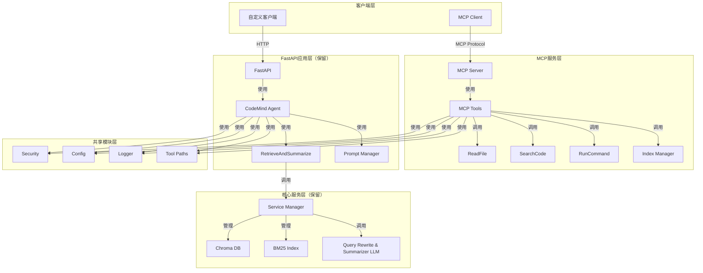
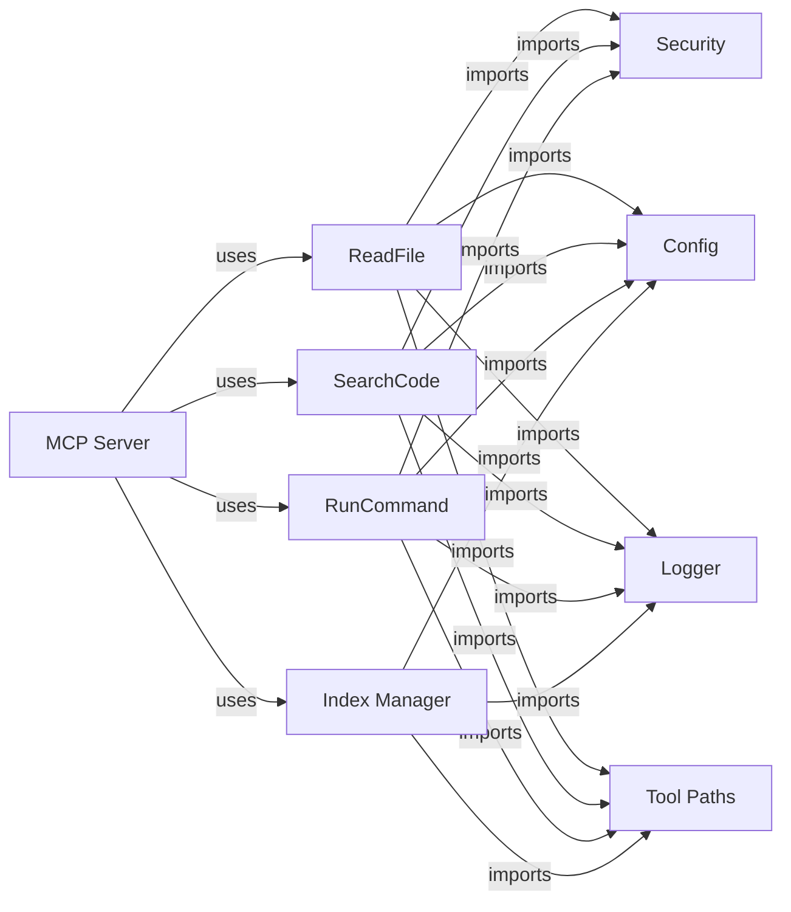

# 系统架构设计

## 整体架构图



## 新目录结构

```
code-mind-agent/
├── app.py                          # 原FastAPI应用（保留）
├── agent/
│   ├── agent.py                    # Agent核心（保留）
│   ├── security.py                 # 安全模块（共享）
│   ├── tool_paths.py               # 路径工具（共享）
│   └── tools/
│       ├── __init__.py
│       ├── retrieve_and_summarize.py  # ⭐ 保留在原应用
│       ├── output_truncation.py
│       ├── read_file.py            # 保留副本作为降级
│       ├── search_code.py          # 保留副本作为降级
│       └── run_command.py          # 保留副本作为降级
├── mcp/                            # ⭐ 新增：MCP服务
│   ├── __init__.py
│   ├── server.py                   # MCP服务器入口
│   ├── tools/
│   │   ├── __init__.py
│   │   ├── base.py                 # MCP工具基类
│   │   ├── read_file.py            # 从agent/tools/迁移
│   │   ├── search_code.py          # 从agent/tools/迁移
│   │   ├── run_command.py          # 从agent/tools/迁移
│   │   └── index_manager/
│   │       ├── __init__.py
│   │       ├── index_repo.py
│   │       ├── add_by_file_path.py
│   │       └── delete_by_file_path.py
│   ├── security.py -> ../agent/security.py  # 符号链接共享
│   ├── tool_paths.py -> ../agent/tool_paths.py
│   └── config.py                   # MCP配置（复用utils/config）
├── scripts/                        # 保留（可被MCP包装调用）
│   ├── index_repo.py
│   ├── add_by_file_path.py
│   └── delete_by_file_path.py
├── services/
│   └── service_manager.py          # ⭐ 保留在原应用
├── utils/
│   ├── config.py                   # 共享配置
│   ├── logger.py                   # 共享日志
│   ├── bm25_index.py               # ⭐ 保留在原应用
│   ├── summarizer.py               # ⭐ 保留在原应用
│   └── fusion.py                   # ⭐ 保留在原应用
├── prompts/                        # 保留在原应用
├── tests/
│   ├── test_fastapi.py             # 原应用测试
│   └── test_mcp/                  # ⭐ 新增：MCP服务测试
│       ├── __init__.py
│       ├── test_server.py
│       └── tools/
│           ├── test_read_file.py
│           ├── test_search_code.py
│           └── test_run_command.py
├── config.yml                      # 共享配置
├── requirements.txt                # 添加MCP依赖
└── mcp_client_config.json          # ⭐ 新增：MCP客户端配置示例
```

## 依赖关系



## 共享模块方案

为了避免代码重复，采用以下共享策略：

1. **符号链接** - `mcp/security.py` -> `agent/security.py`，`mcp/tool_paths.py` -> `agent/tool_paths.py`
2. **直接复用** - `utils/config.py`、`utils/logger.py` 两个服务都通过相同路径导入
3. **复制副本** - 原应用的 `agent/tools/read_file.py`、`search_code.py`、`run_command.py` 保留作为降级路径

### 符号链接的注意事项

- Windows环境下创建符号链接需要管理员权限
- Git会保留符号链接信息，跨平台协作时需注意
- 提供复制脚本作为备选方案
