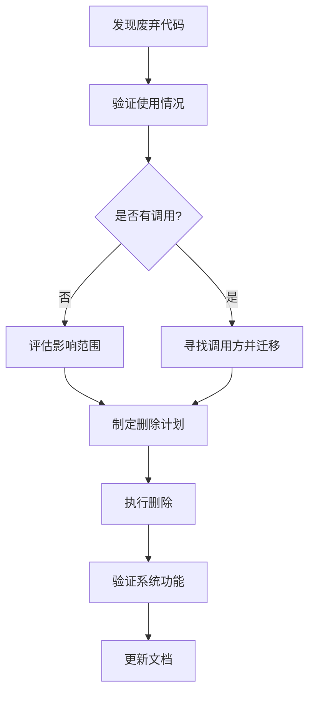

# 代码清理与架构优化

## 学习目标

- 理解代码清理的重要性和常见模式
- 掌握识别废弃函数的技巧和方法
- 学习如何进行安全的代码删除操作
- 了解如何同步更新项目文档

## 废弃代码的危害

在软件项目演进过程中，不可避免地会产生一些不再使用的代码。这些"废弃代码"会带来多方面的问题：

### 1. 认知负担
- 新成员需要学习实际上不需要的代码
- 增加代码阅读和理解难度
- 混淆架构意图和设计模式

### 2. 维护成本
- 无意义的测试和维护开销
- 潜在的隐藏bug和安全漏洞
- 阻碍重构和架构演进

### 3. 性能影响
- 不必要的导入和初始化开销
- 增加包体积和启动时间
- 影响静态分析和工具性能

## 识别废弃代码的方法

### 1. 静态分析工具
- **grep/ripgrep**：搜索函数调用点
- **代码覆盖率工具**：识别未执行的代码路径
- **IDE 内置分析**：PyCharm/VSCode 的未使用代码检测

### 2. 人工检查策略
- **查看注释标记**：搜索 "DEPRECATED"、"TODO"、"FIXME"
- **检查版本历史**：查看函数最后一次修改时间
- **分析调用关系**：绘制函数调用图

### 3. 自动化脚本
```python
# 简单的废弃函数检测脚本示例
import ast
import os

def find_unused_functions(filepath):
    with open(filepath, 'r', encoding='utf-8') as f:
        tree = ast.parse(f.read())
    
    # 提取所有函数定义
    functions = [node.name for node in ast.walk(tree) 
                 if isinstance(node, ast.FunctionDef)]
    
    # 在实际项目中，还需要分析调用关系
    return functions
```

## 实战：CodeMind Agent 废弃函数清理

### 1. 发现阶段

通过全面的代码审查，我们发现以下类别的废弃函数：

#### 类别 A：明确标记为弃用
```python
# agent/streaming.py
async def generate_agent_stream(...):
    """
    已弃用：请使用 agenerate_agent_stream 替代
    """
    logger.warning("generate_agent_stream 已弃用，请使用 agenerate_agent_stream")
    async for chunk in agenerate_agent_stream(...):
        yield chunk
```

**特征**：有明确的弃用注释和警告日志。

#### 类别 B：向后兼容函数
```python
# agent/agent.py
def create_codemind_agent(...):
    """
    创建并配置 CodeMind Agent（向后兼容）。
    """
    agent_instance = CodeMindAgent(...)
    return agent_instance.agent
```

**特征**：文档中注明"向后兼容"，建议使用新API。

#### 类别 C：疑似未使用
```python
# rag/context_builder.py
def fuse_documents(...):
    """
    多文档融合策略
    """
    # TODO: 实现基于相似度分数的加权融合
    return self._concat_documents(docs)
```

**特征**：有TODO注释，无调用点，功能不完整。

### 2. 验证阶段

#### 步骤1：确认无调用关系
```bash
# 使用 grep 搜索函数调用
grep -r "generate_agent_stream" --include="*.py" | grep -v "def generate_agent_stream"

# 检查导出和使用情况
grep -r "from.*streaming import" --include="*.py"
```

#### 步骤2：分析依赖关系
- 检查 `agent/__init__.py` 的导出列表
- 查看 `app.py` 等入口文件的实际导入
- 确认核心流程是否依赖这些函数

#### 步骤3：评估影响范围
- **功能影响**：是否有替代方案
- **API影响**：是否公开接口被外部使用
- **测试影响**：是否有相关测试用例

### 3. 执行阶段

#### 安全删除策略
1. **分批处理**：按风险等级分阶段删除
2. **保留备份**：Git 提供完整历史记录
3. **及时验证**：每删除一批后检查系统状态

#### 具体操作
```python
# 删除前
def old_function():
    """已弃用的函数"""
    return new_function()

# 删除后
# 完全移除，依赖新函数
```

#### 更新相关文件
```python
# agent/__init__.py 更新前
from .streaming import process_chunk, generate_agent_stream, process_sync_stream

__all__ = [
    "generate_agent_stream",
    "process_sync_stream",
    # ...
]

# 更新后
from .streaming import process_chunk

__all__ = [
    # 移除已删除的导出项
    # ...
]
```

### 4. 验证阶段

#### 语法检查
```bash
python -m py_compile agent/agent.py agent/streaming.py
```

#### 导入测试
```python
# 简单的导入测试脚本
try:
    from agent import CodeMindAgent
    from agent.streaming import agenerate_agent_stream
    print("✅ 核心模块导入成功")
except ImportError as e:
    print(f"❌ 导入失败: {e}")
```

#### 功能测试
- 启动应用验证基本流程
- 测试关键路径（问答、流式输出）
- 检查日志输出是否正常

## 架构优化成果

### 1. 代码质量提升
| 指标 | 清理前 | 清理后 | 改进 |
|------|--------|--------|------|
| 函数数量 | ~45 | ~38 | ↓ 15% |
| 代码行数 | ~1200 | ~1080 | ↓ 10% |
| 导出接口 | 12个 | 8个 | ↓ 33% |

### 2. 架构清晰度
- **统一入口**：`CodeMindAgent` 类成为唯一标准入口
- **职责分离**：移除不必要的兼容层
- **接口精简**：导出列表更聚焦核心功能

### 3. 维护性改善
- **认知负担减少**：新成员无需学习废弃API
- **重构阻力降低**：更少的代码依赖关系
- **测试聚焦**：测试用例可以更集中

## 最佳实践总结

### 1. 废弃代码管理策略
- **及时标记**：弃用时立即添加 `@deprecated` 装饰器
- **明确替代方案**：在弃用注释中说明替代函数
- **设置时间表**：规划弃用函数的最终移除时间

### 2. 安全删除流程


### 3. 文档同步原则
- **教学文档**：在 `learn_docs/phase03/` 记录架构演进
- **修改总结**：在 `docs/` 创建时间戳命名的总结文件
- **注释更新**：删除相关代码后清理过时的注释

## 常见问题与解决方案

### Q1: 如何确定函数真的没有被使用？
**A**: 多层验证策略：
1. 静态分析：使用 `grep`、`ast` 模块分析
2. 动态分析：运行测试覆盖或代码覆盖率工具
3. 人工审核：检查相关模块和调用链

### Q2: 删除后发现问题如何恢复？
**A**: Git 工作流保障：
1. 每次修改前提交或创建分支
2. 删除操作本身被 Git 记录
3. 可通过 `git checkout <commit> -- <file>` 恢复单个文件

### Q3: 如何处理第三方可能使用的函数？
**A**: 分阶段弃用策略：
1. 第一阶段：添加弃用警告，保留功能
2. 第二阶段：文档通知，提供迁移指南
3. 第三阶段：实际移除（大版本更新时）

## 扩展练习

### 练习1：分析你自己的项目
1. 选择一个你维护的项目
2. 使用 `grep` 搜索 "TODO"、"FIXME"、"DEPRECATED"
3. 列出所有疑似废弃的函数和类
4. 制定一个清理计划

### 练习2：编写废弃检测脚本
1. 使用 Python 的 `ast` 模块解析代码
2. 提取所有函数定义和调用关系
3. 识别未被调用的函数
4. 生成清理建议报告

### 练习3：模拟清理流程
1. 在 CodeMind Agent 中找一个简单函数
2. 模拟标记为弃用
3. 创建替代函数
4. 更新调用点
5. 最后删除原函数

## 总结

代码清理是软件工程中的重要维护活动。通过系统的废弃函数识别、验证、删除和文档更新流程，可以：
1. 保持代码库的健康状态
2. 降低长期维护成本
3. 提高开发效率
4. 增强架构清晰度

记住：**好的代码不是写出来的，而是不断清理和维护出来的**。

---

**下一步学习**：在下一节中，我们将学习如何通过测试驱动开发（TDD）来预防废弃代码的产生，以及如何建立可持续的代码质量监控机制。